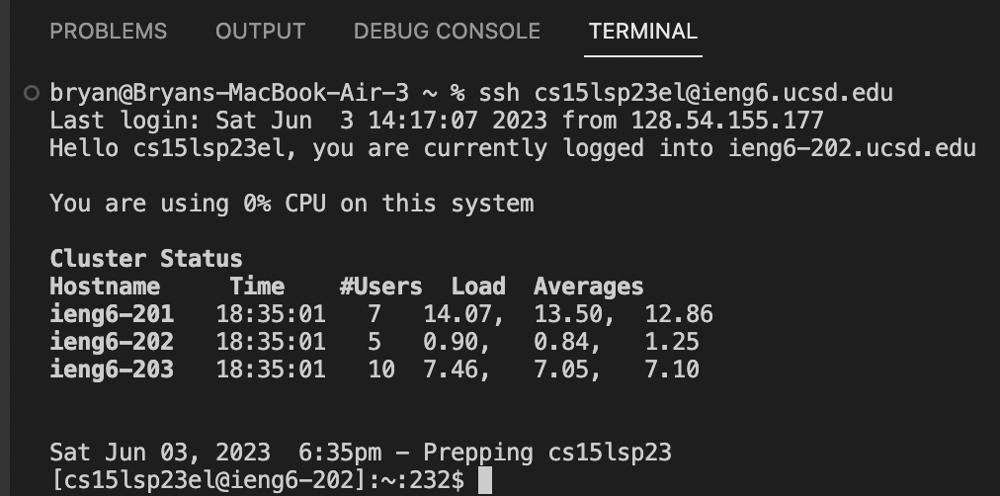
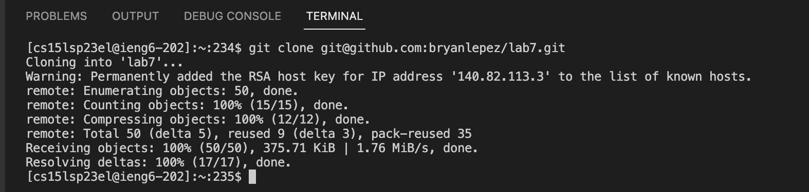
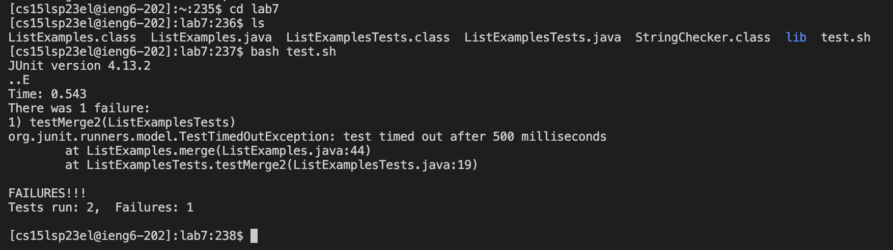
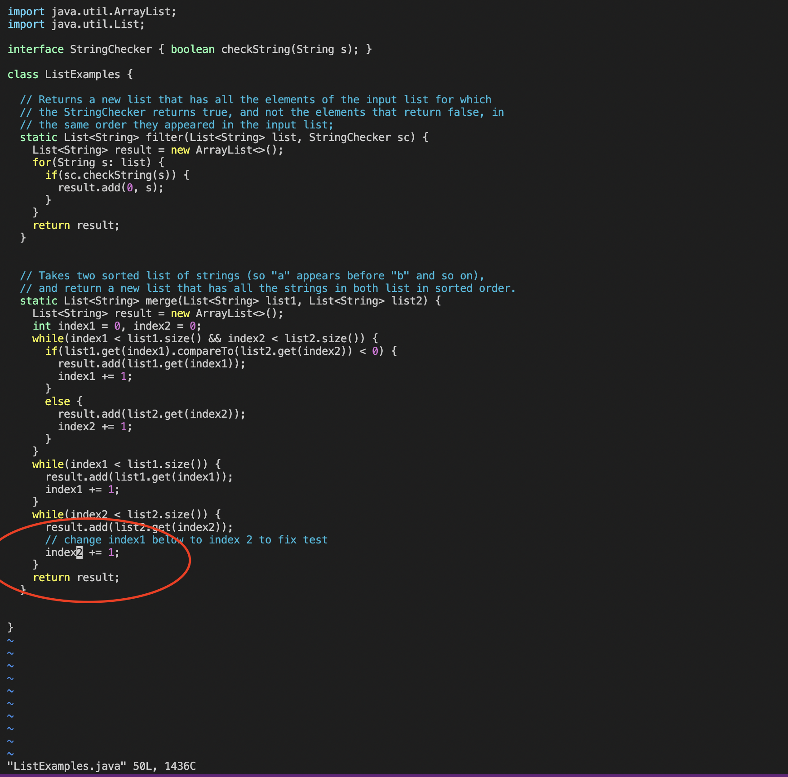
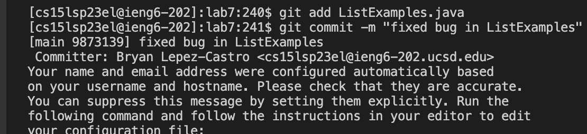
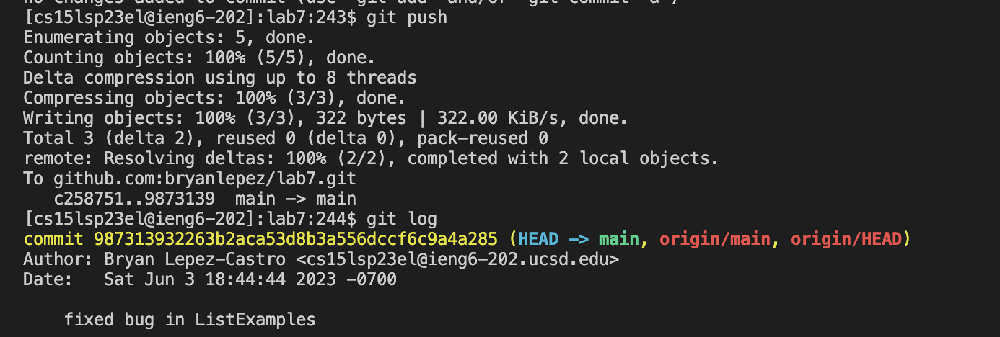
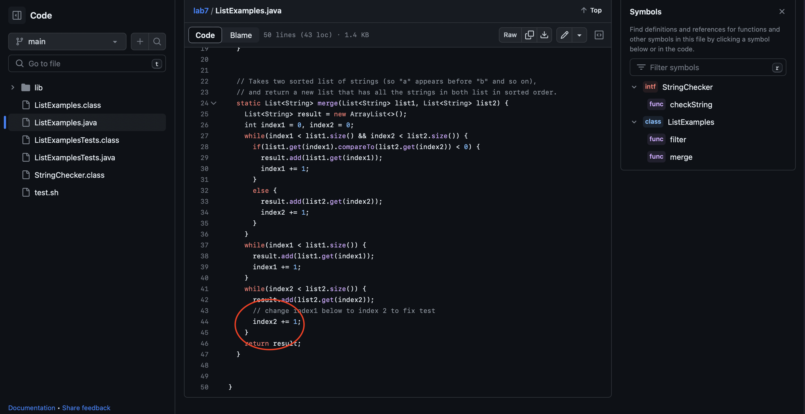

# Lab Report 4 - Reproducing the Tasks
In this Lab Report I will be reproducing the tasks given to us in the lab in the fastest possible way that I have found. As you read the lab
report note that we are doing steps 4-9 from the lab tasks, but I will be numbering them from 1-6

## Step 1: Logging into ieng6
To log into ieng6 the fastest possible way is to simply type in the following:



This is the fastest way possible. As you can see when we login to ieng6, it no longer prompts us to put in our password which makes logging in even 
faster and easier. We were able to do this by following the steps in the lab document.

## Step 2: Cloning the Fork of the Repository
This was another easy step in the process. All we had to to do was go to the "lab7" repository that we forked in our github. In order to do
this I clicked the the green "code" box towards the top right and copied the link. After copying the link from the github repository I went
into the terminal and typed in the following command: ```git clone git@github.com:bryanlepez/lab7.git```. This cloned the repository into our ieng6 machine. You can see how this looks down below:



If you don't know already, you copy with ```command c``` on mac and ```control c``` on windows and paste with ```command p``` and ```control p``` respectively.

## Step 3: Running the Tests to Show the Failure
At first the tests are going to fail because there is a bug in our program(we will see this bug later on). In order to show that the tests failed I first changed my directory to the ```lab7``` directory by doing the command ```cd lab7``` in the terminal. After this I did the ```ls``` command which showed me the contents of the ```lab7``` directory. After running this command we can see that we have a file called ```test.sh``` which contains the commands that we need to run the tests. These commands are:
```javac -cp .:lib/hamcrest-core-1.3.jar:lib/junit-4.13.2.jar *.java``` and ```java -cp .:lib/hamcrest-core-1.3.jar:lib/junit-4.13.2.jar org.junit.runner.JUnitCore ListExamplesTests```.
With this script we know that we can run the tests really fast! All we have to do is do the command ```bash test.sh``` which will automatically run the tests on our program. You can see everything I did and the results of running the tests down below:



As we can see the tests FAILED!. Now let's fix what is causing these failures!

## Step 4: Editing Code to Fix the Failing Test

Now we have to fix the code in order to fix the failing test. How will we do this you may ask. Well instead of opening the file within Visual Studio Code like we used to, we can now use something called "VIM" which let's us do editing straight from the command line. In order to do this we have to know what file we want to open and we know that the file we want to edit is ```ListExamples.java``` since that is where the bug is. All we have to do is type the following command ```vim ListExamples.java```. This will come up with an editing screen with the contents of ```ListExamples.java```. So now let's get into exactly how I fixed this bug in the fastest way possible.

1. Since we know exactly where our bug is we can just look for something that is around the area of the code that we need to change. In the code I noticed that there was a comment above the bug that read ```// change index1 below to index 2 to fix test```. So I naturally used the ```/``` command, which is used to search for a pattern in the code. With this command I did ```/index 2``` because I realized that there was only one thing that matched this exactly which brought me to the pattern immediately. After this I did ```<enter>``` which took me out of the ```/``` command search and had me hovering directly above ```index 2``` in the code.
2. After I got to the point where I'm hovering above ```index 2``` I did the following ```<down><left><left><left><left><left><left>```. This sequence of movements brought me to my cursor hovering above the ```1``` in ```index1``` which we had to change to a ```2```. This was the bug in the program!
3. In order to make this change I found the fastest way was to use the ```r``` command in vim which allows you to replace the character that you are hovering over. Since I was already hovering over the "1" that we needed to change, the keys I pressed were ```<r><2>```. This sequence replaced the ```1``` with a ```2``` and that is our bug fixed!
4. After we fixed our bug we know have to save and exit! I did this by doing the following key presses ```<:><w><q>```. Which gives us ```:wq```. In this case the ```:``` let's a type a command, the ```w``` saves the changes we made and the ```q``` exits vim. This will then take us out of the vim screen and take us back to our terminal!

These were the direct key presses and steps I took to fix the bug in the code within ```ListExamples.java```. 
You can see down below what the code looks like:



## Step 5: Running the Tests to Show Success After Fixing Code
Now we have fixed the bug in our code and have to show that what we did actually worked. In order to check this we to run the tests again. Like we did earlier you might be inclined to type the ```bash test.sh``` command again. However, we want to be as fast as possible. Since we recently used the ```bash test.sh``` command earlier right before we did ```vim ListExamples.java``` we can simply access it in our bash history. Since we used the ```bash test.sh``` command within the last two commands that we typed in the terminal we can simply access it by doing the following key presses ```<up><up><enter>```. The two ```<up>``` key presses will put the ```bash test.sh``` command directly into our command line instead of having to type it all out again. Then the ```<enter>``` key press will run the tests. We can see this below.


YAY! Our tests were successful! We are certified computer scientists!

## Step 6: Commit and Pushing to Our GitHub Account
Now that we have edited our code to make the test successful we have to make sure that we make these changes appear on our repository within GitHub. 

The first thing that I need to do is commit our changes to the local repository. In order to do this I had to add the new version of ```ListExamples.java``` to our local repository by doing the following command in the terminal ```git add ListExamples.java``` this will allow us to now commit the changes to the ```ListExamples.java``` file within our local repostiory.

Next, I had to actually commit the changes to our file by doing ```git commit -m "fixed bug in ListExamples"```. This command let's us commit the changes to the new versions of the files that we added previously. This will not only commit the changes, but also allows us to write a message that will go along with the commit. In this case since I changed the ```ListExamples.java``` file I put "fixed bug in ListExmples" so I know what changes I made. You can see this below:



After we commit the changes that we made and a message for our future selves, we can now push our changes to our actual GitHub repository. In order to do this we have to run the command ```git push```. As you can see below the ```git push``` command pushes our changes to the repository within our Github account and we also run the command ```git log``` to check the changes made. As you can see below our file within the GitHub repository will contain the edited code along with the message that we typed earlier.



Now look at the repository within our GitHub account. It now reflects the changes that we made. All from the command line!!!




---
Well that's the end of my lab report. Hopefully if you follow these steps exactly you will get the same results. I was able to do it in less than six minutes so let's see if you can beat me!


